# Developer Guide: Voice AI Agent with Vision

**Version:** 1.0  
**Last Updated:** October 2025  
**Tech Stack:** Pipecat AI, OpenRouter (Claude), AssemblyAI, ElevenLabs, OpenCV

---

## Table of Contents

1. [Overview](#overview)
2. [Pipecat Architecture 101](#pipecat-architecture-101)
3. [Our Pipeline Architecture](#our-pipeline-architecture)
4. [Data Flow Diagram](#data-flow-diagram)
5. [Key Components](#key-components)
6. [Configuration System](#configuration-system)
7. [Custom Processors](#custom-processors)
8. [Conversation Persistence](#conversation-persistence)
9. [How to Extend](#how-to-extend)
10. [Troubleshooting](#troubleshooting)

---

## Overview

This is a **voice-based AI agent** with **vision capabilities** (webcam) that runs entirely locally on your machine. The agent can:

- 🎤 Listen to your voice through your microphone
- 📝 Transcribe speech to text (AssemblyAI)
- 🎥 Capture webcam images with each interaction
- 🤖 Generate intelligent responses using Claude (via OpenRouter)
- 🔊 Speak responses back using natural TTS (ElevenLabs)
- 💾 Persist conversation history across sessions

**Architecture Style:** Streaming, event-driven pipeline with frame-based processing

---

## Pipecat Architecture 101

Before diving into our specific implementation, it's crucial to understand Pipecat's core concepts.

### What is Pipecat?

[Pipecat](https://docs.pipecat.ai) is a Python framework for building **voice and multimodal conversational AI agents**. It provides a declarative, pipeline-based architecture where data flows through processors as "frames."

### Core Concepts

#### 1. **Frames** - Units of Data

Frames are the fundamental data structures that flow through the pipeline. Think of them as "packets" of information.

**Frame Types:**

| Frame Type | Description | Priority |
|------------|-------------|----------|
| **SystemFrames** | Critical control messages (errors, interruptions) | Immediate (bypass queues) |
| **DataFrames** | Content data (audio, text, images) | Queued (guaranteed order) |
| **ControlFrames** | Lifecycle events (start, end, boundaries) | Queued (guaranteed order) |

**Key Frames in Our System:**

```python
# Audio frames
InputAudioRawFrame      # Raw audio from microphone
OutputAudioRawFrame     # Audio to send to speakers

# Speech & Text frames
TranscriptionFrame      # Transcribed speech from STT
TextFrame              # Streaming text tokens from LLM
LLMFullResponseEndFrame # Marks end of complete LLM response

# Lifecycle frames
StartFrame             # Initialization
EndFrame               # Shutdown signal
```

#### 2. **Frame Processors** - Data Transformers

Frame processors are workers that:
- **Receive frames** from upstream processors
- **Process/transform** the data
- **Push frames** downstream to the next processor

**Critical Rules:**
1. ✅ **ALWAYS** call `await super().process_frame(frame, direction)` first
2. ✅ **ALWAYS** push frames through with `await self.push_frame(frame, direction)`
3. ✅ Process frames **conditionally** using `isinstance()` checks
4. ❌ **NEVER** consume frames without pushing them (blocks the pipeline!)

**Basic Pattern:**

```python
class MyProcessor(FrameProcessor):
    async def process_frame(self, frame: Frame, direction: FrameDirection):
        await super().process_frame(frame, direction)  # ✅ Required
        
        # Conditional processing
        if isinstance(frame, SomeFrameType):
            # Do something with the frame
            pass
        
        await self.push_frame(frame, direction)  # ✅ Required - pass through
```

#### 3. **Pipeline** - The Assembly Line

The Pipeline is an ordered list of processors where frames flow through in sequence:

```python
pipeline = Pipeline([
    processor1,  # Receives frames first
    processor2,  # Receives frames from processor1
    processor3,  # Receives frames from processor2
])
```

**Key Properties:**
- ⚡ **Order matters** - arrange processors so each receives the frame types it needs
- 🔄 **Frames pass through** - processors don't consume, they transform and forward
- 📦 **Guaranteed ordering** - DataFrames and ControlFrames are processed in order
- ⏩ **Parallel processing** - Use `ParallelPipeline` for branching logic

#### 4. **Services** - External API Integrations

Services are specialized processors that integrate with external APIs:

- **STT Services** (`AssemblyAISTTService`) - Convert audio → text
- **LLM Services** (`OpenRouterLLMService`) - Generate AI responses
- **TTS Services** (`ElevenLabsTTSService`) - Convert text → audio
- **Transport Services** (`LocalAudioTransport`) - Handle I/O (mic/speakers)

#### 5. **Transports** - I/O Boundaries

Transports manage the connection between your pipeline and the outside world:

- `transport.input()` - Receives data (audio from mic)
- `transport.output()` - Sends data (audio to speakers)

#### 6. **Context Management**

`LLMContext` tracks conversation state and manages the message history sent to the LLM.

**Key Components:**
- `LLMContext` - Stores conversation messages
- `LLMContextAggregatorPair` - Provides `.user()` and `.assistant()` processors to automatically aggregate messages
- `.user()` - Placed BEFORE LLM, aggregates user messages
- `.assistant()` - Placed AFTER output, aggregates assistant responses

---

## Our Pipeline Architecture

### High-Level Flow

```
User speaks → Mic → STT → Transcription → Webcam Capture → LLM → TTS → Speakers
                                            ↓
                                     Conversation Context
                                     (with vision)
```

### Complete Pipeline Structure

```python
Pipeline([
    transport.input(),              # 1. Audio from microphone
    stt,                            # 2. Speech-to-text (AssemblyAI)
    stt_mute_processor,             # 3. Mute user input while bot speaks
    transcription_logger,           # 4. Log what user said
    image_capture_processor,        # 5. Capture webcam + add to context
    context_aggregator.user(),      # 6. Aggregate user context for LLM
    llm,                            # 7. Generate AI response (OpenRouter)
    tts,                            # 8. Convert text to speech (ElevenLabs)
    transport.output(),             # 9. Audio to speakers
    context_aggregator.assistant(), # 10. Aggregate assistant response
    llm_response_logger,            # 11. Log AI response
])
```

### Why This Order?

1. **STT → Mute Filter** - Transcribe first, then mute (prevents feedback loops)
2. **Image Capture → Context Aggregator** - Must add webcam BEFORE aggregating user message
3. **TTS → Output → Assistant Aggregator** - TTS runs first, output plays it, THEN we aggregate the response for context

---

## Data Flow Diagram

```mermaid
graph TB
    subgraph "Input Phase"
        A[👤 User Speaks] --> B[🎤 Microphone]
        B --> C[Transport Input]
        C --> D[InputAudioRawFrame]
    end
    
    subgraph "Speech Recognition"
        D --> E[AssemblyAI STT Service]
        E --> F[TranscriptionFrame]
        F --> G[STT Mute Filter]
        G --> |"Mutes during bot speech"| H[TranscriptionFrame]
    end
    
    subgraph "Logging & Vision"
        H --> I[Transcription Logger]
        I --> |"🎤 User said: ..."| J[Console Output]
        I --> K[Image Capture Processor]
    end
    
    subgraph "Webcam Capture"
        K --> L{Webcam Available?}
        L --> |Yes| M[cv2.VideoCapture]
        M --> N[Capture Frame]
        N --> O[BGR → RGB Conversion]
        O --> P[PIL Image]
        P --> Q[Extract Raw Bytes]
        Q --> R[Save Debug Image]
        R --> S[Remove Old Webcam Images]
        L --> |No| T[Skip Image Context]
    end
    
    subgraph "Context Management"
        S --> U[Add Webcam to Context]
        U --> V[LLMContext._messages]
        V --> W[Context Aggregator User]
        T --> W
        W --> |"Aggregates transcription + webcam"| X[User Message Ready]
    end
    
    subgraph "LLM Processing"
        X --> Y[OpenRouter LLM Service]
        Y --> |"Streaming tokens"| Z[TextFrame]
        Z --> AA[TextFrame]
        Z --> AB[TextFrame]
        AB --> AC[LLMFullResponseEndFrame]
    end
    
    subgraph "Response Aggregation"
        AA --> AD[LLM Response Logger]
        AD --> |"Buffer tokens"| AE[Response Buffer]
        AC --> AE
        AE --> |"Complete response"| AF[🤖 AI Response: ...]
        AF --> AG[Console Output]
    end
    
    subgraph "Text to Speech"
        AA --> AH[ElevenLabs TTS Service]
        AH --> AI[TTSAudioRawFrame]
        AI --> AJ[OutputAudioRawFrame]
    end
    
    subgraph "Output Phase"
        AJ --> AK[Transport Output]
        AK --> AL[🔊 Speakers]
        AL --> AM[Context Aggregator Assistant]
        AM --> |"Store in context"| V
    end
    
    subgraph "Persistence"
        AN[Conversation Context] --> |"On exit"| AO[save_conversation]
        AO --> AP[conversations/conversation.json]
        AP --> |"On startup"| AQ[load_conversation]
        AQ --> AN
    end
    
    V -.->|"Shared state"| AN
    
    subgraph "Configuration"
        AR[config.yml] --> AS[System Prompt]
        AR --> AT[LLM Model]
        AR --> AU[Voice Settings]
        AS --> Y
        AT --> Y
        AU --> AH
    end
    
    subgraph "Monitoring"
        AV[Whisker Observer] -.->|"Monitors"| C
        AV -.->|"Monitors"| E
        AV -.->|"Monitors"| Y
        AV -.->|"Monitors"| AH
        AV -.->|"Monitors"| AK
    end

    style A fill:#e1f5ff
    style J fill:#fff3cd
    style AG fill:#fff3cd
    style AP fill:#d4edda
    style AR fill:#d4edda
    style M fill:#f8d7da
    style AL fill:#e1f5ff
    style V fill:#e7e7ff
```



### Frame Flow Legend

- **Solid lines** → Data flow
- **Dashed lines** → Monitoring/observation
- **Blue boxes** → User interaction
- **Yellow boxes** → Console logging
- **Green boxes** → File I/O
- **Red boxes** → External hardware
- **Purple boxes** → Shared state

---

## Key Components

### 1. Configuration System (`config.yml`)

**Purpose:** Centralized configuration for bot personality and service settings.

**Structure:**

```yaml
# System Prompt - Bot's personality and instructions
system_prompt: |
  You are Agent 67...
  [Full prompt here]

# Voice settings
elevenlabs:
  voice_id: "mNeKLtUk8yWjz7uDi1dj"
  stability: 0.75
  similarity_boost: 0.75

# LLM settings
llm:
  model: "anthropic/claude-haiku-4.5"
```

**Loading:**

```python
def load_config() -> dict:
    """Loads YAML config and returns dictionary."""
    with open(CONFIG_FILE, "r") as file:
        return yaml.safe_load(file)
```

**Why YAML?**
- ✅ Human-readable
- ✅ Supports multi-line strings (perfect for prompts)
- ✅ Easy to version control
- ✅ No code changes needed to update personality

---

### 2. Custom Frame Processors

We implement **three custom processors** that extend `FrameProcessor`:

#### A. **TranscriptionLogger** (lines 69-78)

**Purpose:** Log user speech to console for debugging.

```python
class TranscriptionLogger(FrameProcessor):
    async def process_frame(self, frame: Frame, direction: FrameDirection):
        await super().process_frame(frame, direction)
        
        if isinstance(frame, TranscriptionFrame):
            print(f"🎤 User said: {frame.text}")
        
        await self.push_frame(frame, direction)
```

**Key Points:**
- ✅ Listens for `TranscriptionFrame`
- ✅ Logs to console
- ✅ Passes frame through unchanged

---

#### B. **LLMResponseLogger** (lines 81-107)

**Purpose:** Log complete LLM responses (not individual streaming tokens).

```python
class LLMResponseLogger(FrameProcessor):
    def __init__(self):
        super().__init__()
        self.response_buffer = ""
        self.is_streaming = False
    
    async def process_frame(self, frame: Frame, direction: FrameDirection):
        await super().process_frame(frame, direction)
        
        if isinstance(frame, TextFrame):
            # Accumulate streaming tokens
            self.response_buffer += frame.text
            self.is_streaming = True
        
        elif isinstance(frame, LLMFullResponseEndFrame):
            # Complete response - log it
            if self.is_streaming and self.response_buffer.strip():
                print(f"🤖 AI Response: {self.response_buffer.strip()}")
            
            # Reset for next response
            self.response_buffer = ""
            self.is_streaming = False
        
        await self.push_frame(frame, direction)
```

**Key Points:**
- 🔄 **Stateful** - maintains buffer across frames
- 📦 **Aggregates** streaming tokens into complete response
- 🎯 **Waits** for `LLMFullResponseEndFrame` to log
- ✅ Passes all frames through

---

#### C. **ImageCaptureProcessor** (lines 110-261) ⭐ MOST COMPLEX

**Purpose:** Capture webcam image on each transcription and add to LLM context.

**Lifecycle:**

```python
class ImageCaptureProcessor(FrameProcessor):
    def __init__(self, context: LLMContext):
        super().__init__()
        self._context = context
        self._webcam_marker = "__webcam__"
        self._webcam = None
        self._init_webcam()  # Initialize camera on startup
```

**Key Methods:**

##### `_init_webcam()` (lines 124-143)

```python
def _init_webcam(self):
    """Initialize webcam once at startup."""
    self._webcam = cv2.VideoCapture(0)  # Camera index 0
    if not self._webcam.isOpened():
        logger.error("❌ Could not open webcam")
        self._webcam = None
```

**Why initialize once?**
- ⚡ Performance - camera initialization is expensive
- 🔒 Resource management - only one camera connection
- 🛡️ Graceful degradation - agent still works without webcam

---

##### `_take_webcam_photo()` (lines 145-187)

```python
def _take_webcam_photo(self) -> tuple[bytes, tuple[int, int], str] | None:
    """
    Capture webcam frame and return raw pixel bytes.
    
    Returns:
        (raw_bytes, size, mode) or None if capture fails
    """
    # Capture frame
    ret, frame = self._webcam.read()  # BGR format
    
    # Convert BGR → RGB (LLMs expect RGB)
    frame_rgb = cv2.cvtColor(frame, cv2.COLOR_BGR2RGB)
    
    # Convert to PIL Image
    img = Image.fromarray(frame_rgb)
    
    # Return RAW PIXEL BYTES (not encoded!)
    raw_bytes = img.tobytes()
    
    return raw_bytes, img.size, img.mode  # e.g., "RGB"
```

**Critical Details:**

1. **BGR → RGB Conversion**
   - OpenCV uses BGR by default
   - LLM APIs expect RGB
   - Must convert!

2. **Raw vs. Encoded Bytes**
   - ❌ Don't return PNG/JPEG bytes
   - ✅ Return raw pixel data
   - Pipecat's `add_image_frame_message()` encodes internally

3. **Return Format**
   - `raw_bytes`: Uncompressed pixel data
   - `size`: `(width, height)` tuple
   - `mode`: PIL image mode like `"RGB"` (NOT file format like `"PNG"`)

---

##### `_remove_old_images()` (lines 189-202)

```python
def _remove_old_images(self):
    """Remove old webcam images from context."""
    self._context._messages = [
        msg for msg in self._context._messages
        if not (isinstance(msg.get("content"), list) and 
               any(item.get("text", "").startswith(self._webcam_marker)
                   for item in msg.get("content", []) if isinstance(item, dict)))
    ]
```

**Why?**
- 🎯 Keep context size manageable
- 🔄 Only the **most recent** webcam image is relevant
- 💰 Reduce API costs (images are expensive tokens!)

**How?**
- Uses marker `"__webcam__"` to identify image messages
- Filters out any message with content containing this marker

---

##### `process_frame()` (lines 204-261)

**Complete Flow:**

```python
async def process_frame(self, frame: Frame, direction: FrameDirection):
    await super().process_frame(frame, direction)
    
    # Only process TranscriptionFrame
    if isinstance(frame, TranscriptionFrame):
        # 1. Capture webcam
        webcam_result = self._take_webcam_photo()
        if not webcam_result:
            await self.push_frame(frame, direction)
            return
        
        webcam_bytes, webcam_size, webcam_mode = webcam_result
        
        # 2. Save debug image locally
        webcam_path = f"./screenshots/webcam_{timestamp}.jpg"
        debug_webcam = Image.frombytes(webcam_mode, webcam_size, webcam_bytes)
        debug_webcam.save(webcam_path)
        
        # 3. Remove old images from context
        self._remove_old_images()
        
        # 4. Add new image to context
        self._context.add_image_frame_message(
            image=webcam_bytes,
            text=f"{self._webcam_marker} User webcam view",
            size=webcam_size,
            format=webcam_mode,  # "RGB", not "PNG"!
        )
    
    # Always push frame through
    await self.push_frame(frame, direction)
```

**Why This Works:**

1. **Triggers on TranscriptionFrame** - Image captured AFTER user finishes speaking
2. **Modifies context directly** - Image added before `context_aggregator.user()`
3. **Doesn't block pipeline** - Frame is pushed through even if capture fails

---

### 3. STT Mute Filter

```python
stt_mute_processor = STTMuteFilter(
    config=STTMuteConfig(
        strategies={STTMuteStrategy.ALWAYS}
    ),
)
```

**Purpose:** Prevent the agent from processing its own voice.

**How it works:**
- When bot starts speaking → mutes transcription processing
- When bot stops speaking → unmutes transcription processing
- Prevents feedback loops and unwanted interruptions

**Strategy: ALWAYS**
- Mutes during ALL bot speech
- Alternative: `FIRST_SYNTHESIS` (only mute during first response)

---

### 4. Conversation Persistence

#### Save on Exit (lines 269-293)

```python
def save_conversation(context: LLMContext) -> str:
    """Save conversation to JSON file."""
    os.makedirs(os.path.dirname(CONVERSATION_FILE), exist_ok=True)
    
    with open(CONVERSATION_FILE, "w") as file:
        messages = context._messages
        json.dump(messages, file, indent=2)
    
    return CONVERSATION_FILE
```

**Called in `finally` block:**

```python
try:
    await runner.run(task)
finally:
    save_conversation(context)
```

---

#### Load on Startup (lines 296-321)

```python
def load_conversation(context: LLMContext) -> bool:
    """Load conversation from JSON file."""
    if not os.path.exists(CONVERSATION_FILE):
        return False
    
    with open(CONVERSATION_FILE, "r") as file:
        messages = json.load(file)
        context._messages = messages
    
    return True
```

**Why this pattern?**
- ✅ Stateful conversations across sessions
- ✅ Agent "remembers" previous interactions
- ✅ Useful for development (don't lose context on restart)
- ⚠️ Note: Images are NOT persisted (too large, only text context)

---

### 5. Pipeline Parameters

```python
params = PipelineParams(
    allow_interruptions=False,
)
```

**Key Setting: `allow_interruptions=False`**

- Prevents user from interrupting bot mid-speech
- Agent finishes speaking before processing new input
- Creates more natural turn-taking

**Why disable interruptions?**
- 🎭 Better for character agents (Agent 67 is theatrical)
- 🗣️ Reduces awkward cutoffs
- 📊 Cleaner conversation flow

**When to enable:**
- Real-time customer support (urgent interruptions needed)
- Debugging/testing (want to stop bot quickly)

---

## Configuration System

### File Structure

```
pipecat-class/
├── config.yml              # Main configuration
├── .env                    # API keys (NOT in git)
├── main.py                 # Application code
└── conversations/          # Persisted conversation history
    └── conversation.json
```

### Environment Variables (`.env`)

```bash
ASSEMBLYAI_API_KEY=your_key_here
OPENROUTER_API_KEY=your_key_here
ELEVENLABS_API_KEY=your_key_here
```

**Security:**
- ✅ `.env` is in `.gitignore`
- ✅ Never commit API keys
- ✅ Use environment variables for secrets

### Configuration Loading

```python
# Load config
config = load_config()

# Extract sections
llm_config = config.get("llm", {})
elevenlabs_config = config.get("elevenlabs", {})
system_prompt = config.get("system_prompt", "You are a helpful assistant.")

# Apply to services
llm = OpenRouterLLMService(
    api_key=os.getenv("OPENROUTER_API_KEY"),
    model=llm_config.get("model", "anthropic/claude-haiku-4.5"),
)

tts = ElevenLabsTTSService(
    api_key=os.getenv("ELEVENLABS_API_KEY"),
    voice_id=elevenlabs_config.get("voice_id", "default_voice"),
    stability=elevenlabs_config.get("stability", 0.5),
    similarity_boost=elevenlabs_config.get("similarity_boost", 0.75),
)
```

---

## How to Extend

### Adding a New Custom Processor

**Example: Add a profanity filter**

```python
class ProfanityFilter(FrameProcessor):
    """Filters out profanity from transcriptions."""
    
    def __init__(self):
        super().__init__()
        self.bad_words = ["badword1", "badword2"]
    
    async def process_frame(self, frame: Frame, direction: FrameDirection):
        await super().process_frame(frame, direction)
        
        if isinstance(frame, TranscriptionFrame):
            # Filter profanity
            text = frame.text
            for word in self.bad_words:
                text = text.replace(word, "***")
            
            # Create new frame with filtered text
            filtered_frame = TranscriptionFrame(
                text=text,
                user_id=frame.user_id,
                timestamp=frame.timestamp
            )
            
            # Push modified frame
            await self.push_frame(filtered_frame, direction)
            return  # Don't push original frame
        
        # Pass other frames through
        await self.push_frame(frame, direction)
```

**Add to pipeline:**

```python
profanity_filter = ProfanityFilter()

pipeline = Pipeline([
    transport.input(),
    stt,
    stt_mute_processor,
    profanity_filter,        # ← Add here
    transcription_logger,
    # ... rest of pipeline
])
```

---

### Adding Screen Capture

Want to add screenshot capability alongside webcam?

```python
import mss

class ImageCaptureProcessor(FrameProcessor):
    def __init__(self, context: LLMContext):
        super().__init__()
        self._context = context
        self._webcam_marker = "__webcam__"
        self._screenshot_marker = "__screenshot__"  # ← New marker
        self._webcam = None
        self._init_webcam()
    
    def _take_screenshot(self) -> tuple[bytes, tuple[int, int], str]:
        """Capture screenshot of primary monitor."""
        with mss.mss() as sct:
            monitor = sct.monitors[1]  # Primary monitor
            screenshot = sct.grab(monitor)
            
            # Convert to PIL Image (BGRA on macOS)
            img = Image.frombytes("RGBA", screenshot.size, screenshot.bgra, "raw", "BGRA")
            img = img.convert("RGB")
            
            # Return raw pixel bytes
            return img.tobytes(), img.size, img.mode
    
    async def process_frame(self, frame: Frame, direction: FrameDirection):
        await super().process_frame(frame, direction)
        
        if isinstance(frame, TranscriptionFrame):
            # Capture webcam
            webcam_result = self._take_webcam_photo()
            
            # Capture screenshot
            screenshot_bytes, screenshot_size, screenshot_mode = self._take_screenshot()
            
            # Remove old images
            self._remove_old_images()
            
            # Add screenshot
            self._context.add_image_frame_message(
                image=screenshot_bytes,
                text=f"{self._screenshot_marker} Screen view",
                size=screenshot_size,
                format=screenshot_mode,
            )
            
            # Add webcam if available
            if webcam_result:
                webcam_bytes, webcam_size, webcam_mode = webcam_result
                self._context.add_image_frame_message(
                    image=webcam_bytes,
                    text=f"{self._webcam_marker} User view",
                    size=webcam_size,
                    format=webcam_mode,
                )
        
        await self.push_frame(frame, direction)
```

**Update system prompt:**

```yaml
system_prompt: |
  You have vision capabilities - you can see both:
  1. The user's screen (via screenshot)
  2. The user themselves (via webcam)
  
  When asked about what you see, reference both appropriately.
```

---

### Changing LLM Provider

Want to use OpenAI instead of OpenRouter?

```python
# Replace
from pipecat.services.openrouter.llm import OpenRouterLLMService

# With
from pipecat.services.openai import OpenAILLMService

# Update in run_bot()
llm = OpenAILLMService(
    api_key=os.getenv("OPENAI_API_KEY"),
    model=llm_config.get("model", "gpt-4-turbo"),
)
```

**Update `.env`:**

```bash
OPENAI_API_KEY=sk-...
```

---

### Adding Function Calling

Let the agent take actions (e.g., web search, API calls):

```python
from pipecat.services.openai import FunctionCallParams

# Define function
def get_weather(location: str) -> str:
    """Get weather for a location."""
    # Call weather API
    return f"The weather in {location} is sunny."

# Add to LLM service
llm = OpenAILLMService(
    api_key=os.getenv("OPENAI_API_KEY"),
    model="gpt-4-turbo",
    functions=[
        FunctionCallParams(
            name="get_weather",
            description="Get current weather for a location",
            parameters={
                "type": "object",
                "properties": {
                    "location": {"type": "string"}
                },
                "required": ["location"]
            },
            callback=get_weather,
        )
    ]
)
```

Now the LLM can call `get_weather()` when users ask about weather!

---

## Troubleshooting

### Common Issues

#### 1. **Webcam Not Working**

**Symptoms:**
```
⚠️ Webcam not available, skipping webcam capture
```

**Solutions:**

1. Check camera permissions (macOS System Settings → Privacy & Security → Camera)
2. Close other apps using the camera (Zoom, Skype, etc.)
3. Try different camera index:

```python
# In _init_webcam()
self._webcam = cv2.VideoCapture(1)  # Try index 1, 2, etc.
```

4. List available cameras:

```python
for i in range(5):
    cap = cv2.VideoCapture(i)
    if cap.isOpened():
        print(f"Camera {i} available")
        cap.release()
```

---

#### 2. **"unrecognized image mode" Error**

**Symptoms:**
```
ValueError: unrecognized image mode
```

**Cause:** Passing encoded image bytes (PNG/JPEG) instead of raw pixel data.

**Solution:**

```python
# ❌ Wrong
buffer = BytesIO()
img.save(buffer, format="PNG")
image_bytes = buffer.getvalue()
return image_bytes, img.size, "PNG"

# ✅ Correct
raw_bytes = img.tobytes()
return raw_bytes, img.size, img.mode  # img.mode is "RGB", not "PNG"
```

---

#### 3. **Bot Interrupting Itself**

**Symptoms:** Agent stops mid-sentence or talks over itself.

**Solutions:**

1. **Check STT Mute Filter:**

```python
stt_mute_processor = STTMuteFilter(
    config=STTMuteConfig(
        strategies={STTMuteStrategy.ALWAYS}  # ← Should be ALWAYS
    ),
)
```

2. **Check Pipeline Order:**

```python
pipeline = Pipeline([
    stt,
    stt_mute_processor,     # ← Must come AFTER stt
    transcription_logger,
    # ...
])
```

3. **Disable Interruptions:**

```python
params = PipelineParams(
    allow_interruptions=False,  # ← Should be False
)
```

---

#### 4. **API Rate Limiting**

**Symptoms:**
```
openai.RateLimitError: Rate limit exceeded
```

**Solutions:**

1. **Add rate limiting:**

```python
import asyncio

class RateLimiter(FrameProcessor):
    def __init__(self, min_delay: float = 1.0):
        super().__init__()
        self.min_delay = min_delay
        self.last_request = 0
    
    async def process_frame(self, frame: Frame, direction: FrameDirection):
        await super().process_frame(frame, direction)
        
        if isinstance(frame, TranscriptionFrame):
            now = asyncio.get_event_loop().time()
            elapsed = now - self.last_request
            
            if elapsed < self.min_delay:
                await asyncio.sleep(self.min_delay - elapsed)
            
            self.last_request = now
        
        await self.push_frame(frame, direction)
```

2. **Use cheaper models:**

```yaml
llm:
  model: anthropic/claude-haiku-4.5  # Cheaper than Opus
```

---

#### 5. **High Latency / Slow Responses**

**Optimization checklist:**

1. **Use faster models:**
   - `anthropic/claude-haiku-4.5` (fastest)
   - `anthropic/claude-sonnet-4.5` (balanced)
   - `anthropic/claude-opus-4.5` (slowest)

2. **Reduce image resolution:**

```python
def _take_webcam_photo(self):
    ret, frame = self._webcam.read()
    
    # Resize to reduce token usage
    frame_resized = cv2.resize(frame, (640, 480))  # Lower resolution
    
    frame_rgb = cv2.cvtColor(frame_resized, cv2.COLOR_BGR2RGB)
    # ... rest of processing
```

3. **Optimize system prompt:**
   - Shorter prompts = faster responses
   - Remove unnecessary examples

4. **Use streaming TTS:**
   - ElevenLabs already streams by default
   - Agent starts speaking as soon as first audio chunk arrives

---

#### 6. **Conversation Not Persisting**

**Symptoms:** Agent doesn't remember previous interactions.

**Solutions:**

1. **Check file permissions:**

```bash
ls -la conversations/
```

2. **Verify save is called:**

```python
# In run_bot()
finally:
    saved_file = save_conversation(context)
    logger.info(f"Saved to: {saved_file}")  # Should see this on exit
```

3. **Check load order:**

```python
# Load AFTER creating context, BEFORE aggregator
context = LLMContext(messages)
load_conversation(context)  # ← Must be here
context_aggregator = LLMContextAggregatorPair(context)
```

---

## Performance Tips

### 1. Image Optimization

**Problem:** Webcam images use many tokens (expensive + slow).

**Solution:** Resize images before adding to context.

```python
def _take_webcam_photo(self):
    ret, frame = self._webcam.read()
    
    # Resize to reasonable resolution
    max_width = 800
    height, width = frame.shape[:2]
    if width > max_width:
        scale = max_width / width
        new_width = max_width
        new_height = int(height * scale)
        frame = cv2.resize(frame, (new_width, new_height))
    
    # ... rest of processing
```

---

### 2. Context Window Management

**Problem:** Long conversations exceed context window.

**Solution:** Implement context pruning.

```python
def _prune_context(self, max_messages: int = 20):
    """Keep only recent messages (excluding system prompt)."""
    if len(self._context._messages) > max_messages:
        system_msg = self._context._messages[0]  # Preserve system prompt
        recent_messages = self._context._messages[-(max_messages-1):]
        self._context._messages = [system_msg] + recent_messages
```

---

### 3. Caching

**Problem:** Redundant API calls for similar inputs.

**Solution:** Cache recent responses.

```python
from functools import lru_cache

class CachedLLMService(FrameProcessor):
    def __init__(self, llm_service):
        super().__init__()
        self.llm = llm_service
        self.cache = {}
    
    @lru_cache(maxsize=100)
    def _get_cache_key(self, text: str) -> str:
        return text.lower().strip()
    
    async def process_frame(self, frame: Frame, direction: FrameDirection):
        # Add caching logic here
        pass
```

---

## Debugging Tips

### 1. Enable Verbose Logging

```python
# Change log level
logger.remove(0)
logger.add(sys.stderr, level="TRACE")  # More verbose than DEBUG
```

---

### 2. Inspect Frames

```python
class FrameInspector(FrameProcessor):
    """Log ALL frames passing through."""
    
    async def process_frame(self, frame: Frame, direction: FrameDirection):
        await super().process_frame(frame, direction)
        
        logger.debug(f"Frame: {frame.__class__.__name__} | Direction: {direction}")
        
        await self.push_frame(frame, direction)
```

---

### 3. Monitor API Usage

Use Whisker observer:

```python
whisker = WhiskerObserver(pipeline)

# View metrics at: https://app.getwhisker.io
```

---

## Resources

### Official Documentation

- **Pipecat Docs:** https://docs.pipecat.ai
- **AssemblyAI:** https://www.assemblyai.com/docs
- **OpenRouter:** https://openrouter.ai/docs
- **ElevenLabs:** https://elevenlabs.io/docs

### Community

- **Pipecat Discord:** https://discord.gg/pipecat
- **GitHub Issues:** https://github.com/pipecat-ai/pipecat/issues

### Dependencies

```toml
[dependencies]
pipecat-ai[assemblyai,elevenlabs,local,openrouter] = ">=0.0.90"
pipecat-ai-whisker = ">=0.0.10"
opencv-python = ">=4.10.0"
pillow = ">=11.0.0"
python-dotenv = ">=1.1.1"
pyyaml = ">=6.0"
```

---

## Architecture Decision Records

### Why Local Audio Transport?

**Decision:** Use `LocalAudioTransport` instead of WebRTC.

**Rationale:**
- ✅ Simpler setup (no server needed)
- ✅ Lower latency (direct mic/speaker access)
- ✅ Better for local development/demos
- ❌ Can't be accessed remotely

**Alternative:** Use `DailyTransport` for web-based access.

---

### Why OpenRouter?

**Decision:** Use OpenRouter instead of direct OpenAI/Anthropic APIs.

**Rationale:**
- ✅ Single API for multiple providers
- ✅ Easy model switching
- ✅ Automatic fallbacks
- ✅ Built-in rate limiting
- ❌ Slightly higher latency (proxy overhead)

---

### Why Disable Interruptions?

**Decision:** Set `allow_interruptions=False`.

**Rationale:**
- ✅ Better for character agents (theatrical performance)
- ✅ Cleaner conversation flow
- ✅ Prevents awkward cutoffs
- ❌ Less responsive to urgent user input

**Use case dependent:** Enable for customer support bots.

---

## Contributing

### Code Style

- Use type hints
- Document with docstrings (Google style)
- Keep functions under 50 lines
- Name variables descriptively

### Testing Changes

1. Test with fresh conversation (delete `conversations/conversation.json`)
2. Test with existing conversation (keep history)
3. Test webcam failure case (cover camera)
4. Test with different prompts (edit `config.yml`)

---

## Changelog

### v1.0 (October 2025)

- ✅ Initial implementation
- ✅ Webcam vision capability
- ✅ Conversation persistence
- ✅ YAML configuration system
- ✅ STT mute filter
- ✅ Non-interruptible mode

---

## License

BSD 2-Clause License (see file header in `main.py`)

---

**Last Updated:** October 17, 2025  
**Maintained By:** Development Team  
**Questions?** Open an issue or ask in Discord!

