# Developer Guide: Voice Agent Module (Pipecat)

Version: 1.1
Last Updated: October 2025
Tech Stack: Pipecat AI, OpenRouter (Claude), AssemblyAI, ElevenLabs, OpenCV

---

## Table of Contents

1. Overview
2. Module Layout
3. Running the Agent (CLI & Programmatic)
4. Pipecat Architecture 101
5. Our Pipeline Architecture
6. Data Flow Diagram
7. Key Components
8. Configuration System
9. Custom Processors
10. Memory (Conversation Persistence)
11. How to Extend
12. Troubleshooting
13. Performance Tips
14. Debugging Tips

---

## Overview

This is a voice-based AI agent with optional vision (webcam) that runs locally. The agent can:

- Listen via microphone and transcribe speech (AssemblyAI)
- Capture webcam images and attach to LLM context (optional)
- Generate responses using Claude via OpenRouter
- Speak natural TTS using ElevenLabs
- Store conversation history as memory across sessions (optional)

Architecture Style: Streaming, event-driven pipeline with frame-based processing

---

## Module Layout

Source lives under `src/voice_agent` and is installable. Public API is the `VoiceAgent` class, plus a CLI.

- `src/voice_agent/app.py` — `VoiceAgent` class (public API)
- `src/voice_agent/cli.py` — CLI entrypoint (`voice-agent`, or `python -m voice_agent`)
- `src/voice_agent/config.py` — YAML loading
- `src/voice_agent/constants.py` — common paths (config, conversations, screenshots)
- `src/voice_agent/logging.py` — Loguru setup
- `src/voice_agent/settings.py` — .env loading and API key validation
- `src/voice_agent/memory/conversation_store.py` — save/load conversation
- `src/voice_agent/pipeline/builder.py` — pipeline assembly
- `src/voice_agent/pipeline/params.py` — pipeline params factory
- `src/voice_agent/processors/` — custom processors (logging, vision, filters)
- `src/voice_agent/services/` — STT/LLM/TTS service factories
- `src/voice_agent/transports/` — local audio transport factory
- `src/voice_agent/observers/whisker.py` — optional Whisker observer

Top-level files kept:
- `config.yml` — main configuration
- `conversations/` — memory store folder (JSON)
- `screenshots/` — debug webcam images

---

## Running the Agent (CLI & Programmatic)

CLI (recommended after install):
- `voice-agent --config ./config.yml`

Module without install:
- `PYTHONPATH=src python -m voice_agent --config ./config.yml`

Flags:
- `--no-vision` disable webcam capture
- `--no-memory` disable conversation memory
- `--allow-interruptions` allow user to interrupt TTS
- `--log-level INFO` adjust logging

Programmatic usage:
```python
from voice_agent import VoiceAgent
import asyncio

async def main():
    agent = VoiceAgent(config_path="./config.yml", vision=True, memory=True)
    await agent.start()

asyncio.run(main())
```

Embedding in a “robot brain” (external lifecycle management):
```python
from voice_agent import VoiceAgent
agent = VoiceAgent(config_path="./config.yml", vision=False, memory=True)
task, runner = agent.build_task()
runner.run(task)  # manage lifecycle externally, or integrate into your loop
```

---

## Pipecat Architecture 101

Pipecat provides a pipeline where data flows as frames through processors.

Frames (examples we use):
```python
InputAudioRawFrame      # Raw audio from microphone
OutputAudioRawFrame     # Audio to speakers
TranscriptionFrame      # User speech transcribed by STT
TextFrame               # Streaming tokens from LLM
LLMFullResponseEndFrame # End of a complete LLM response
StartFrame, EndFrame    # Lifecycle
```

Frame processors must:
1) call `await super().process_frame(frame, direction)` first
2) call `await self.push_frame(frame, direction)` to forward frames
3) process selectively via `isinstance`

Pipeline properties:
- Order matters
- Frames pass through (transform, don’t consume)
- Queued ordering for data/control frames

Services used:
- STT: `AssemblyAISTTService`
- LLM: `OpenRouterLLMService`
- TTS: `ElevenLabsTTSService`
- Transport: `LocalAudioTransport`

Context:
- `LLMContext` stores conversation
- `LLMContextAggregatorPair` provides `.user()` and `.assistant()` aggregators

---

## Our Pipeline Architecture

High-Level Flow:
```
User → Mic → STT → Transcription → (Webcam) → LLM → TTS → Speakers
                                   ↓
                             Conversation Context
```

Complete Pipeline:
```python
Pipeline([
    transport.input(),              # 1. Audio from microphone
    stt,                            # 2. Speech-to-text (AssemblyAI)
    stt_mute_processor,             # 3. Mute user input while bot is speaking
    transcription_logger,           # 4. Log what user said
    image_capture_processor,        # 5. (optional) capture webcam and add to context
    context_aggregator.user(),      # 6. Aggregate user context for LLM
    llm,                            # 7. Generate AI response (OpenRouter)
    tts,                            # 8. Convert text to speech (ElevenLabs)
    transport.output(),             # 9. Audio to speakers
    context_aggregator.assistant(), # 10. Aggregate assistant response
    llm_response_logger,            # 11. Log AI response
])
```

Why this order?
1) STT → Mute Filter: prevents feedback loops
2) Webcam before aggregation: add vision to the user turn
3) TTS → Output → Assistant aggregate: capture spoken response into memory

---

## Data Flow Diagram

```mermaid
graph TB
    subgraph "Input Phase"
        A[👤 User Speaks] --> B[🎤 Microphone]
        B --> C[Transport Input]
        C --> D[InputAudioRawFrame]
    end
    
    subgraph "Speech Recognition"
        D --> E[AssemblyAI STT Service]
        E --> F[TranscriptionFrame]
        F --> G[STT Mute Filter]
        G --> |"Mutes during bot speech"| H[TranscriptionFrame]
    end
    
    subgraph "Logging & Vision"
        H --> I[Transcription Logger]
        I --> |"🎤 User said: ..."| J[Console Output]
        I --> K[Image Capture Processor]
    end
    
    subgraph "Webcam Capture"
        K --> L{Webcam Available?}
        L --> |Yes| M[cv2.VideoCapture]
        M --> N[Capture Frame]
        N --> O[BGR → RGB Conversion]
        O --> P[PIL Image]
        P --> Q[Extract Raw Bytes]
        Q --> R[Save Debug Image]
        R --> S[Remove Old Webcam Images]
        L --> |No| T[Skip Image Context]
    end
    
    subgraph "Context Management"
        S --> U[Add Webcam to Context]
        U --> V[LLMContext._messages]
        V --> W[Context Aggregator User]
        T --> W
        W --> |"Aggregates transcription + webcam"| X[User Message Ready]
    end
    
    subgraph "LLM Processing"
        X --> Y[OpenRouter LLM Service]
        Y --> |"Streaming tokens"| Z[TextFrame]
        Z --> AA[TextFrame]
        Z --> AB[TextFrame]
        AB --> AC[LLMFullResponseEndFrame]
    end
    
    subgraph "Response Aggregation"
        AA --> AD[LLM Response Logger]
        AD --> |"Buffer tokens"| AE[Response Buffer]
        AC --> AE
        AE --> |"Complete response"| AF[🤖 AI Response: ...]
        AF --> AG[Console Output]
    end
    
    subgraph "Text to Speech"
        AA --> AH[ElevenLabs TTS Service]
        AH --> AI[TTSAudioRawFrame]
        AI --> AJ[OutputAudioRawFrame]
    end
    
    subgraph "Output Phase"
        AJ --> AK[Transport Output]
        AK --> AL[🔊 Speakers]
        AL --> AM[Context Aggregator Assistant]
        AM --> |"Store in context"| V
    end
    
    subgraph "Memory"
        AN[Conversation Context] --> |"On exit"| AO[save_conversation]
        AO --> AP[conversations/conversation.json]
        AP --> |"On startup"| AQ[load_conversation]
        AQ --> AN
    end
    
    V -.->|"Shared state"| AN
    
    subgraph "Configuration"
        AR[config.yml] --> AS[System Prompt]
        AR --> AT[LLM Model]
        AR --> AU[Voice Settings]
        AS --> Y
        AT --> Y
        AU --> AH
    end
    
    subgraph "Monitoring"
        AV[Whisker Observer] -.->|"Monitors"| C
        AV -.->|"Monitors"| E
        AV -.->|"Monitors"| Y
        AV -.->|"Monitors"| AH
        AV -.->|"Monitors"| AK
    end

    style A fill:#e1f5ff
    style J fill:#fff3cd
    style AG fill:#fff3cd
    style AP fill:#d4edda
    style AR fill:#d4edda
    style M fill:#f8d7da
    style AL fill:#e1f5ff
    style V fill:#e7e7ff
```



Frame Flow Legend

- Solid lines → Data flow
- Dashed lines → Monitoring/observation
- Blue boxes → User interaction
- Yellow boxes → Console logging
- Green boxes → File I/O
- Red boxes → External hardware
- Purple boxes → Shared state

---

## Key Components

1) Configuration (config.yml)
- Stores system prompt and service settings
- YAML is human-readable and great for multi-line prompts
- Loaded via `voice_agent.config.load_config()`

2) Custom Frame Processors
- `TranscriptionLogger` logs `TranscriptionFrame` text
- `LLMResponseLogger` buffers tokens and logs final LLM response
- `ImageCaptureProcessor` captures webcam, stores image in context prior to aggregation

3) STT Mute Filter
- Prevents agent from processing its own voice
- Strategy: ALWAYS mute during TTS
- Factory in `processors/filters.py`

4) Memory (Conversation Persistence)
- `memory/conversation_store.py` handles save/load to `./conversations/conversation.json`
- Images are filtered out; only text is stored

5) Pipeline Parameters
- Factory in `pipeline/params.py`
- Default `allow_interruptions=False` for natural turn-taking

---

## Configuration System

File Structure:
```
pipecat-class/
├── config.yml              # Main configuration
├── .env                    # API keys (NOT in git)
└── conversations/          # Conversation memory
    └── conversation.json
```

Environment Variables (`.env`):
```
ASSEMBLYAI_API_KEY=...
OPENROUTER_API_KEY=...
ELEVENLABS_API_KEY=...
```

Loading and applying config (simplified):
```python
from voice_agent.config import load_config
from voice_agent.services.llm import make_llm
from voice_agent.services.tts import make_tts

config = load_config("./config.yml")
llm = make_llm(config.get("llm", {}))
tts = make_tts(config.get("elevenlabs", {}))
```

---

## Custom Processors

Transcription Logger (`processors/transcription_logger.py`):
```python
if isinstance(frame, TranscriptionFrame):
    print(f"🎤 User said: {frame.text}")
```

LLM Response Logger (`processors/llm_response_logger.py`):
```python
if isinstance(frame, TextFrame):
    buffer += frame.text
elif isinstance(frame, LLMFullResponseEndFrame):
    print("🤖 AI Response:", buffer.strip())
    buffer = ""
```

Image Capture (`processors/image_capture.py`):
- Captures webcam frame on `TranscriptionFrame`
- Adds image to `LLMContext` before user aggregation
- Saves debug image to `./screenshots/`

---

## Memory (Conversation Persistence)

Save on Exit:
```python
from voice_agent.memory.conversation_store import save_conversation
saved_file = save_conversation(context)
```

Load on Startup:
```python
from voice_agent.memory.conversation_store import load_conversation
load_conversation(context)
```

Why this pattern?
- Stateful conversations across sessions
- Agent remembers previous interactions
- Images not persisted (too large); text only

---

## How to Extend

Adding a new custom processor:
```python
class ProfanityFilter(FrameProcessor):
    async def process_frame(self, frame: Frame, direction: FrameDirection):
        await super().process_frame(frame, direction)
        if isinstance(frame, TranscriptionFrame):
            # modify frame or create new one
            pass
        await self.push_frame(frame, direction)
```

Add to pipeline in `pipeline/builder.py` near other pre-aggregation processors:
```python
processors_pre_agg = [transport.input(), stt, stt_mute, transcription_logger]
processors_pre_agg.append(ProfanityFilter())
```

Embedding in a robot brain:
```python
from voice_agent import VoiceAgent
agent = VoiceAgent(config_path="./config.yml", vision=False, memory=True)
task, runner = agent.build_task()
runner.run(task)  # manage lifecycle externally
```

---

## Troubleshooting

1) Missing API keys
- Ensure `.env` has `ASSEMBLYAI_API_KEY`, `OPENROUTER_API_KEY`, `ELEVENLABS_API_KEY`
- Keys loaded via `settings.load_env()` automatically

2) Webcam not available
- Run with `--no-vision`
- Or ensure camera permissions are granted

3) Conversation not persisting
- Check `./conversations/` permissions
- Confirm save on exit logs a path
- Ensure `memory=True` (default) or not using `--no-memory`

4) No audio output
- Verify output device and OS permissions
- Confirm `audio_out_enabled=True` in `transports/local_audio.py`

---

## Performance Tips

1) Image Optimization
- Resize webcam frames before adding to context (reduce token cost)

2) Context Window Management
- Prune old messages (keep system prompt + N recent turns)

3) Prompt Optimization
- Shorter system prompts → faster, cheaper calls

4) Streaming TTS
- ElevenLabs streams by default; bot starts speaking quickly

---

## Debugging Tips

Verbose logging
```python
from voice_agent.logging import setup_logging
setup_logging("TRACE")
```

Frame inspection
```python
class FrameInspector(FrameProcessor):
    async def process_frame(self, frame: Frame, direction: FrameDirection):
        await super().process_frame(frame, direction)
        print(type(frame).__name__, frame)
        await self.push_frame(frame, direction)
```

